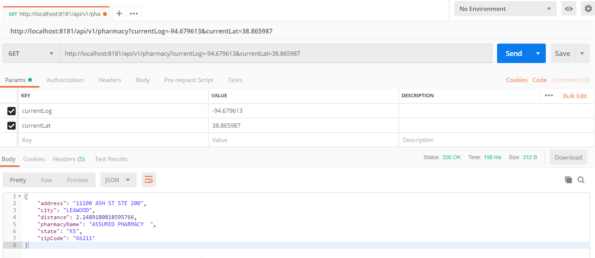

# PharmacyService
This service provides pharmacy details.

## Setup

### From IDE
1. Clone the project from the github repo.
2. Use the IDE(Eclipse or any other Maven, Java supporting IDE) to import an existing Maven project.
3. Once Maven is done importing all the dependencies, expand the com.pharmacy.service package to find the PharmacyServiceApplication class.
4. Right click on the class then select run as and then select 'Java Application'
5. The Spring application will then start at http://localhost:8181 and will wait for any request.
6. From a Rest Client eg, Postman send a GET request on the url http://localhost:8181/api/v1/pharmacy?currentLog=[currentLongitude]&currentLat=[currentLatitude], for eg. http://localhost:8181/api/v1/pharmacy?currentLog=-94.679613&currentLat=38.865987 . 

### Stand alone
Since this is a SpringBoot Maven project, the jar built using the command 'mvn clean install' can be used to run standalone using "java -jar pharmacyService-0.0.1-SNAPSHOT.jar" command.

## Tools and Technology
To initialize the work on the project, Spring Initilizer(https://start.spring.io/) was used. This service uses Java as a language, Maven as project type and SptingBoot version 2.3.4 was used. The data source used for this service is a CSV file which contains rows of Pharmacies and OpenCSV library was used to read them in the memory. Eclipse was used as an IDE.

## Model
This service uses two Model Objects.

### Pharmacy
This is a POJO(plain old java object) that is initialized through a constructor and contains information about a pharmacy like Name, Address, City, State, ZipCode and its longitude and latitude.

### NearestPharmacyPacket
This is a POJO(plain old java object) that is initialized through a constructor and contains information about a pharmacy like Name, Address, City, State, ZipCode and the distance to it.

## Controller
This service has one Controller.

### PharmacyContorller
This is the Rest Controller for the Pharmacy Service and it has the following endpoints.

#### Find Nearest Pharmacy
The end point will take in latitude and longitude and search on the nearest pharmacy among the number of pharmacies whose information is available. This end point uses the Pharmacy Utilities to read the Pharmacy objects from the CSV file and finds the nearest pharmacy by using the Distance utility.

### Pharmacy Utilities
These are a collection of methods that can be used by different controllers for eg, PharmacyController. This currently has 2 utilities.

#### Distance utility
This utility calculates the distance between two longitudes and longitudes points using the Haversine formula.

#### CSV Utility
This utility understands the Pharmacy Model. It will read the content of the pharmacies.csv file and return a list of Pharmacy objects.

## Result
The following image shows the result of a successful rest call to the Find Nearest Pharmacy endpoint.

